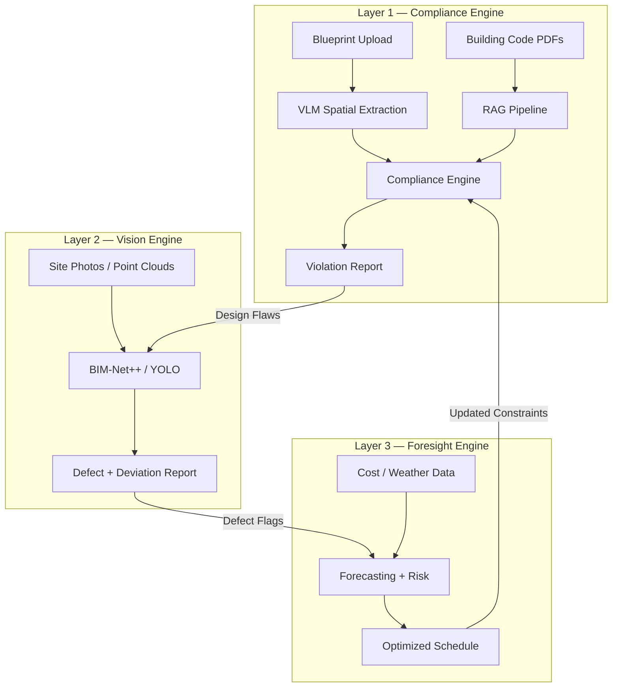

# 🏗️ SafeSite AI — 3-Layer Construction Intelligence Platform
### KAYA Hackathon · Track 4: Open Innovation

SafeSite AI is an agentic AI system that addresses the **three most costly blind spots** in construction — design errors, build defects, and schedule overruns — through three interconnected AI engines that form a closed feedback loop.

---

## 🔄 Core Differentiator: The Interconnected Loop

```
Layer 1 flags design flaws → Layer 2 identifies as-built defects → Layer 3 recalculates schedule/cost/risk → feeds back
```

This isn't three separate tools — it's **one system** where every detection in one layer automatically triggers recalculation in the others.

---

## 🌟 The 3-Layer System

### 📐 Layer 1 — Compliance Engine (Pre-Construction)
> *"Is this design legal?"*

- **Spatial Extraction via VLM**: Gemini 2.5 Flash extracts hallway widths, door swings, room areas, stairwell dimensions, and exit distances from uploaded blueprints (`.pdf` / `.png` / `.jpg`).
- **Code Retrieval via RAG**: ChromaDB + `bge-large-en-v1.5` embeddings against National Building Code 2016 Part IV (Fire & Life Safety) and IS 456:2000.
- **Agentic Compliance Loop**: Cross-references extracted spatial data against retrieved code clauses with severity grading.
- **Output**: Flagged violations with exact location, measurement vs. requirement, code citation (e.g., *"Hallway B2 is 3ft wide, NBC §4.3.2 requires minimum 4ft"*).

### 🔍 Layer 2 — Vision Engine (Active Build)
> *"Does reality match the design?"*

- **Point Cloud Segmentation**: BIM-Net++ (pretrained on HePIC dataset) converts raw scans into labeled structural elements (walls, columns, slabs).
- **Defect Detection**: YOLOv11-seg / SAM 2 for surface-level defects (cracks, spalling, honeycombing, exposed rebar) with pixel-level masks.
- **BIM Deviation Alignment**: ICP-based overlay of as-built data against BIM files to compute mm-level deviation per element.
- **Stage 1 Fallback**: VLM-based defect analysis on site photos (zero-shot via Gemini).

### 🔮 Layer 3 — Foresight Engine (Continuous)
> *"What will happen next, and what should we do?"*

- **Time-Series Forecasting**: Prophet / XGBoost / TFT for material lead-time and price volatility prediction.
- **Bayesian Risk Modeling**: Monte Carlo simulation (10,000+ iterations) for probabilistic delay/completion estimates (e.g., *"82% on-time, 14% risk of 3-week delay"*).
- **MILP Resource Optimization**: SciPy/Gurobi-based re-optimization triggered automatically when Layer 2 flags rework-requiring defects.

---

## 🏛️ Architecture Overview



---

## 🛠️ Technology Stack

| Layer | Technology |
|-------|-----------|
| Frontend | HTML5, Vanilla CSS, JavaScript (dark mode, glassmorphism) |
| Backend | Python 3.10+ / FastAPI / Uvicorn |
| VLM | Google Gemini 2.5 Flash |
| Embeddings | `bge-large-en-v1.5` (BAAI) via `sentence-transformers` |
| Vector Store | ChromaDB |
| PDF Parsing | PyMuPDF (`fitz`) |
| Point Cloud | BIM-Net++ (HePIC dataset) |
| Defect Detection | YOLOv11-seg / SAM 2 |
| Forecasting | Prophet / XGBoost / TFT |
| Risk Modeling | Monte Carlo / Bayesian Belief Network |
| Optimization | SciPy `milp` / Gurobi |
| Reports | fpdf2 |

---

## 📊 Datasets & Models

| Purpose | Dataset | Model |
|---|---|---|
| Blueprint parsing | FloorPlanCAD, MSD, CubiASA | Gemini 2.5 Flash (zero-shot) |
| Building codes | NBC India 2016, IS 456:2000, fire codes | RAG: ChromaDB + bge-large-en-v1.5 |
| Point cloud → BIM | HePIC dataset | BIM-Net++ |
| Concrete defects | CODEBRIM, CONCORDE | YOLOv11-seg / SAM 2 |
| PPE detection (stretch) | Roboflow Hard Hat Workers | YOLOv8 |
| Cost forecasting | Kaggle datasets, CIDC indices | Prophet / XGBoost / TFT |

---

## 📂 Repository Structure

```
KAYA-Hackathon-SafeSite-AI/
├── backend/
│   ├── main.py                      # FastAPI entry point
│   ├── config.py                    # Settings & env vars
│   ├── models.py                    # Pydantic schemas
│   ├── layer1_compliance/           # Blueprint compliance engine
│   ├── layer2_vision/               # Defect detection & BIM alignment
│   ├── layer3_foresight/            # Forecasting & optimization
│   ├── feedback_loop.py             # Cross-layer orchestration
│   ├── report_generator.py          # PDF reports
│   └── requirements.txt
├── frontend/
│   ├── index.html                   # Dashboard shell
│   ├── css/styles.css               # Design system
│   └── js/                          # Tab-specific logic
├── data/                            # Sample data for demos
├── models/                          # Pretrained weights (Stage 2)
├── Info on construction/            # NBC 2016 & IS 456 PDFs
├── notebooks/                       # PoC notebooks per layer
├── implementation_plan.md           # Full implementation plan
├── .gitignore
└── README.md
```

---

## 🚀 Getting Started

### Prerequisites
- Python 3.10+
- Google Gemini API Key (`GEMINI_API_KEY`)

### Setup
```bash
git clone https://github.com/om-is-inert/KAYA-Hackathon-SafeSite-AI.git
cd KAYA-Hackathon-SafeSite-AI
python -m venv venv
venv\Scripts\activate          # Windows
pip install -r backend/requirements.txt
```

### Environment
Create `backend/.env`:
```env
GEMINI_API_KEY=your_google_ai_studio_key_here
CHROMA_PERSIST_DIR=./data/chroma_db
EMBEDDING_MODEL=BAAI/bge-large-en-v1.5
```

### Run
```bash
uvicorn backend.main:app --reload --port 8000
```

---

## 🏆 KAYA Hackathon Track 4 Alignment
- **Real Construction Problem**: Targets the three most expensive failure modes in Indian construction — design errors, build defects, and schedule overruns.
- **Deep AI Integration**: Chains VLM extraction → RAG retrieval → agentic reasoning → computer vision → time-series forecasting → MILP optimization in a single interconnected loop.
- **Ground-Truth Regulatory Knowledge**: Every compliance flag is backed by section numbers and page citations from NBC 2016 / IS 456:2000.
- **Predictive, Not Just Reactive**: Layer 3 doesn't just report problems — it forecasts risks and automatically re-optimizes resources.
