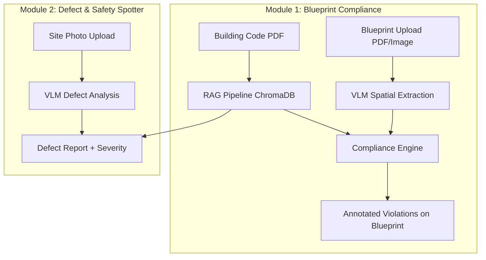

# 🏗️ SafeSite AI — Automated Building Code & Safety Compliance
### KAYA Hackathon · Track 4: Open Innovation

SafeSite AI is an agentic AI system designed to solve two massive, unaddressed problems in the construction industry:
1. **Blueprint Compliance Checking** — Automatically cross-reference architectural floor plans against Indian building codes (NBC 2016 / IS 456:2000) using Vision-Language Models (VLMs) + Retrieval-Augmented Generation (RAG).
2. **Visual Defect Detection** — Analyze daily construction site photos to detect cracks, honeycombing, rebar exposure, and safety hazards, grounding every observation in IS 456 standards.

---

## 🌟 Key Features

### 📐 1. Blueprint Compliance Checker (Module 1)
- **Spatial Extraction via VLM**: Extracts hallway widths, door swings, room areas, stairwell dimensions, and exit distances directly from uploaded blueprints (`.pdf` / `.png` / `.jpg`).
- **Code Retrieval via RAG**: Queries National Building Code 2016 Part IV (Fire & Life Safety) and IS 456:2000 to find exact regulatory thresholds.
- **Automated Flagging**: Pinpoints code violations on the blueprint (e.g., *"Hallway B2 width is 3ft, code §4.3.2 requires minimum 4ft for fire escape"*).

### 🔍 2. Visual Defect & Safety Spotter (Module 2)
- **Site Photo Analysis**: Detects structural defects (concrete cracks, honeycombing, exposed/rusted rebar) and safety non-compliance (missing PPE, unstable scaffolding, fall hazards).
- **Code Grounding**: Links detected defects to specific IS 456 clauses (`§14` for honeycombing, `§26.4` for clear cover requirements).
- **Actionable Remediation**: Generates instant severity ratings (`CRITICAL`, `HIGH`, `MEDIUM`, `LOW`) and practical remediation steps.

---

## 🏛️ Architecture Overview



---

## 🛠️ Technology Stack

- **Frontend**: Responsive Web Dashboard (HTML5, Vanilla CSS, JavaScript)
- **Backend API**: Python FastAPI (`uvicorn`)
- **Vision-Language Model**: Google Gemini 2.5 Flash
- **RAG & Vector Store**: `ChromaDB` + `sentence-transformers` (`all-MiniLM-L6-v2`)
- **Document Processing**: `PyMuPDF` (`fitz`) for NBC/IS 456 PDF parsing
- **Report Export**: `fpdf2` for downloadable compliance PDFs

---

## 📂 Repository Structure

```
KAYA-Hackathon-SafeSite-AI/
├── Images of Construction sites/   # Reference images for defect/safety detection
├── Info on construction/           # Building Code PDFs (NBC 2016 Part IV, IS 456:2000)
├── backend/                        # FastAPI server & AI engines (in progress)
├── frontend/                       # Interactive web dashboard (in progress)
├── Some Context.txt                # Hackathon problem brief & datasets
├── implementation_plan.md          # Full architectural implementation plan
├── .gitignore                      # Git ignore rules
└── README.md                       # Project documentation
```

---

## 🚀 Getting Started (Local Development)

### Prerequisites
- Python 3.10+
- Google Gemini API Key (`GEMINI_API_KEY`)

### Installation & Setup
1. **Clone the repository**:
   ```bash
   git clone https://github.com/om-is-inert/KAYA-Hackathon-SafeSite-AI.git
   cd KAYA-Hackathon-SafeSite-AI
   ```

2. **Set up Python Virtual Environment**:
   ```bash
   python -m venv venv
   # On Windows:
   venv\Scripts\activate
   # On macOS/Linux:
   source venv/bin/activate
   ```

3. **Install Dependencies**:
   ```bash
   pip install -r backend/requirements.txt
   ```

4. **Set up Environment Variables**:
   Create a `.env` file inside the `backend/` directory:
   ```env
   GEMINI_API_KEY=your_google_ai_studio_key_here
   ```

5. **Run the Server**:
   ```bash
   uvicorn backend.main:app --reload --port 8000
   ```

---

## 🏆 KAYA Hackathon Track 4 Alignment
- **Real Construction Problem**: Targeted directly at reducing costly rework and saving lives on Indian construction sites.
- **Deep AI Integration**: Goes far beyond a basic LLM prompt wrapper by chaining Vision-Language extraction with Document Intelligence RAG.
- **Ground-Truth Regulatory Knowledge**: Every flag is backed by section numbers and page citations from NBC 2016 / IS 456:2000.
