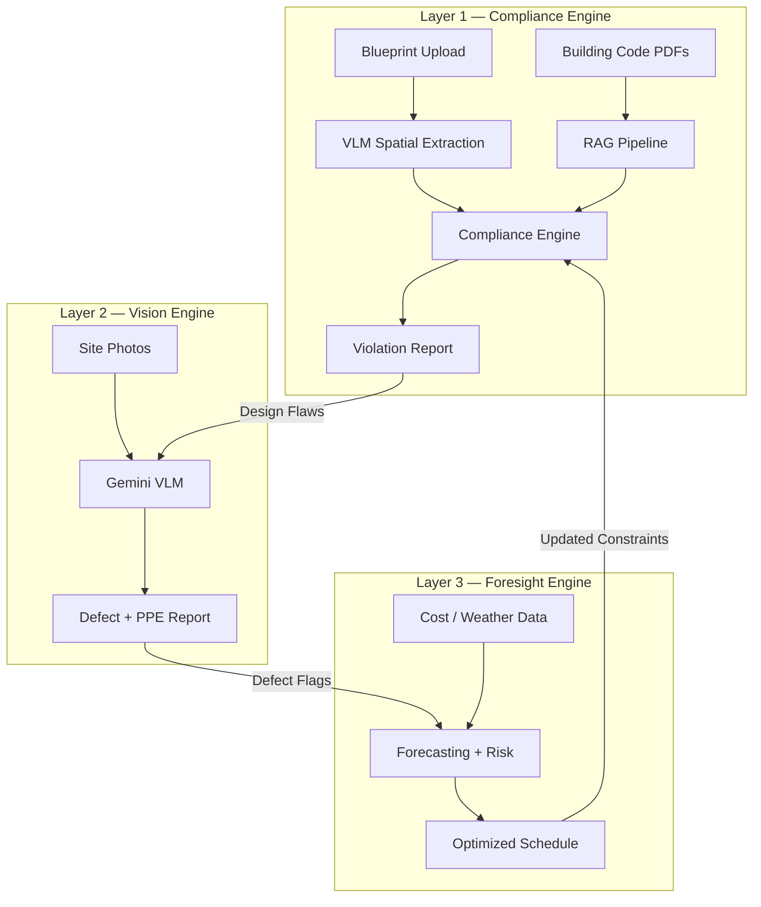

# 🏗️ SafeSite AI — 3-Layer Construction Intelligence Platform
### KAYA Hackathon · Track 4: Open Innovation

SafeSite AI is an agentic AI system that addresses the **three most costly blind spots** in construction — design errors, build defects, and schedule overruns — through three interconnected AI engines that form a closed feedback loop.

---

## 🔄 Core Differentiator: The Interconnected Loop

```
Layer 1 flags design flaws → Layer 2 identifies as-built defects → Layer 3 recalculates schedule/cost/risk → feeds back
```

This isn't three separate tools — it's **one system** where every detection in one layer automatically triggers recalculation in the others.

---

## 🌟 The 3-Layer System

### 📐 Layer 1 — Compliance Engine (Pre-Construction)
> *"Is this design legal?"*

- **Spatial Extraction via VLM**: Gemini 2.5 Flash extracts hallway widths, door swings, room areas, stairwell dimensions, and exit distances from uploaded blueprints (`.pdf` / `.png` / `.jpg`).
- **Code Retrieval via RAG**: numpy cosine-similarity search over `gemini-embedding-001` vectors against National Building Code 2016 Part IV (Fire & Life Safety) and IS 456:2000.
- **Agentic Compliance Loop**: Cross-references extracted spatial data against retrieved code clauses with severity grading.
- **Output**: Flagged violations with exact location, measurement vs. requirement, code citation (e.g., *"Hallway B2 is 3ft wide, NBC §4.3.2 requires minimum 4ft"*).

### 🔍 Layer 2 — Vision Engine (Active Build)
> *"Does reality match the design?"*

- **Defect Detection**: Zero-shot VLM (Gemini 2.5 Flash) identifies surface-level defects (cracks, spalling, honeycombing, exposed rebar) on site photos today; a fine-tuned YOLOv11-seg pixel-mask path is scaffolded in code, gated behind a flag, pending trained weights.
- **BIM Deviation Alignment**: Pure geometric Scan-to-BIM comparison of as-built element dimensions against the Layer 1 blueprint.
- **PPE / Site Safety Audit**: Zero-shot VLM safety audit against the SH17 PPE taxonomy.

### 🔮 Layer 3 — Foresight Engine (Continuous)
> *"What will happen next, and what should we do?"*

- **Time-Series Forecasting**: Exponential smoothing over synthetic cost-index data today (demo forecaster); Prophet/XGBoost on live CIDC data is roadmap.
- **Monte Carlo Risk Modeling**: Real `numpy` stochastic simulation (10,000+ iterations) for probabilistic delay/completion estimates (e.g., *"82% on-time, 14% risk of 3-week delay"*).
- **MILP Resource Optimization**: Real `scipy.optimize.milp` integer programming, re-optimizing automatically when Layer 2 flags rework-requiring defects.

---

## 🏛️ Architecture Overview


```mermaid
graph TB
    subgraph "Layer 1 — Compliance Engine"
        A[Blueprint Upload] --> B[VLM Spatial Extraction]
        C[Building Code PDFs] --> D[RAG Pipeline]
        B --> E[Compliance Engine]
        D --> E
        E --> F[Violation Report]
    end

    subgraph "Layer 2 — Vision Engine"
        G[Site Photos] --> H[Gemini VLM]
        H --> I[Defect + PPE Report]
    end

    subgraph "Layer 3 — Foresight Engine"
        J[Cost / Weather Data] --> K[Forecasting + Risk]
        K --> L[Optimized Schedule]
    end

    F -->|Design Flaws| H
    I -->|Defect Flags| K
    L -->|Updated Constraints| E
```

---

## 🛠️ Technology Stack

| Layer | Technology |
|-------|-----------|
| Frontend | React / Vite (Cloudflare Pages) |
| Backend | Python 3.10+ / FastAPI / Uvicorn (Render) |
| VLM | Google Gemini 2.5 Flash |
| Embeddings | Google `gemini-embedding-001` |
| Vector Store | numpy cosine-similarity (in-process) |
| PDF Parsing | PyMuPDF (`fitz`) |
| Defect / PPE Detection | Gemini 2.5 Flash zero-shot VLM (YOLOv11-seg fallback path scaffolded, not live) |
| Forecasting | Exponential smoothing on synthetic data (demo); Prophet/XGBoost on live data is roadmap |
| Risk Modeling | Monte Carlo simulation (`numpy`, 10,000 iterations) |
| Optimization | SciPy `milp` (real integer programming) |
| Reports | fpdf2 |
| Resiliency | Gemini Free-Tier Rate Limit Retries, Multi-pass JSON Repair Utility |

---

## 📊 Datasets & Models

| Purpose | Dataset | Model |
|---|---|---|
| Blueprint parsing | Uploaded blueprint images/PDFs | Gemini 2.5 Flash (zero-shot) |
| Building codes | NBC India 2016 Part IV, IS 456:2000 | RAG: numpy + `gemini-embedding-001` |
| Concrete/structural defects | Site photos | Gemini 2.5 Flash zero-shot VLM (YOLOv11-seg/SAM2 fine-tune is roadmap) |
| PPE detection | Site photos, SH17-informed prompts | Gemini 2.5 Flash zero-shot VLM |
| Cost forecasting | Synthetic demo data | Exponential Smoothing (Current) / Prophet (Planned) |

---

## 📂 Repository Structure

```
KAYA-Hackathon-SafeSite-AI/
├── backend/
│   ├── main.py                      # FastAPI entry point
│   ├── config.py                    # Settings & env vars
│   ├── models.py                    # Pydantic schemas
│   ├── layer1_compliance/           # Blueprint compliance engine
│   ├── layer2_vision/               # Defect detection & BIM alignment
│   ├── layer3_foresight/            # Forecasting & optimization
│   ├── feedback_loop.py             # Cross-layer orchestration
│   ├── report_generator.py          # PDF reports
│   └── requirements.txt
├── frontend/
│   ├── index.html                   # Dashboard shell
│   ├── css/styles.css               # Design system
│   └── js/                          # Tab-specific logic
├── data/                            # Sample data for demos
├── models/                          # Pretrained weights (Stage 2)
├── Info on construction/            # NBC 2016 & IS 456 PDFs
├── notebooks/                       # PoC notebooks per layer
├── implementation_plan.md           # Full implementation plan
├── .gitignore
└── README.md
```

---

## 🚀 Getting Started

### Prerequisites
- Python 3.10+
- Google Gemini API Key (`GEMINI_API_KEY`)

### Setup
```bash
git clone https://github.com/om-is-inert/KAYA-Hackathon-SafeSite-AI.git
cd KAYA-Hackathon-SafeSite-AI
python -m venv venv
venv\Scripts\activate          # Windows
pip install -r backend/requirements.txt
```

### Environment
Create `backend/.env`:
```env
GEMINI_API_KEY=your_google_ai_studio_key_here
CHROMA_PERSIST_DIR=./data/chroma_db
DEMO_SEED=42 # Optional: Set to pin the Monte Carlo RNG for reproducible demo numbers
```

### Run
```bash
uvicorn backend.main:app --reload --port 8000
```

---

## 🏆 KAYA Hackathon Track 4 Alignment
- **Real Construction Problem**: Targets the three most expensive failure modes in Indian construction — design errors, build defects, and schedule overruns.
- **Deep AI Integration**: Chains VLM extraction → RAG retrieval → agentic reasoning → computer vision → time-series forecasting → MILP optimization in a single interconnected loop.
- **Ground-Truth Regulatory Knowledge**: Every compliance flag is backed by section numbers and page citations from NBC 2016 / IS 456:2000.
- **Predictive, Not Just Reactive**: Layer 3 doesn't just report problems — it forecasts risks and automatically re-optimizes resources.
