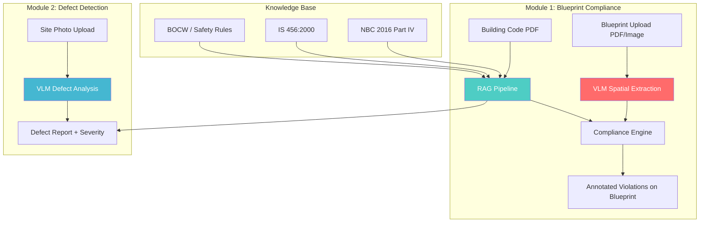

# 🏗️ SafeSite AI v2 — Combined Implementation Plan
## Blueprint Compliance + Visual Defect Detection
### KAYA Hackathon · Track 4: Open Innovation

---

## Project Vision

**Two-module platform:**
1. **Blueprint Compliance Checker** (Primary) — Upload blueprint + building code → AI flags exact violations with measurements
2. **Visual Defect Spotter** (Secondary) — Upload site photo → detect cracks, exposed rebar, structural issues

---

## Architecture



---

## Tech Stack

| Layer | Technology |
|-------|-----------|
| Frontend | HTML + CSS + Vanilla JS |
| Backend | Python + FastAPI |
| VLM | Google Gemini 2.5 Flash |
| Embeddings | `all-MiniLM-L6-v2` |
| Vector Store | ChromaDB |
| PDF Parsing | PyMuPDF |
| Reports | fpdf2 |

---

## Module 1: Blueprint Compliance Checker (Core)

### What It Does
1. User uploads a **floor plan / blueprint** (PDF or image)
2. User selects which codes to check against (NBC 2016, IS 456, or uploads custom)
3. VLM **extracts spatial data** from the blueprint (room dimensions, hallway widths, door positions, staircase widths, exit locations)
4. RAG **retrieves relevant code requirements** (min hallway width, fire escape distance, stairwell requirements)
5. Engine **cross-references** extracted measurements vs. code requirements
6. Output: Annotated blueprint with **exact violation locations** + code references

### Example Violations Detected
| What VLM Extracts | Code Requirement | Violation |
|---|---|---|
| Hallway width: 3ft | NBC requires 4ft for fire escape corridor | ❌ "Hallway B2 is 3ft wide, code §4.3.2 requires minimum 4ft" |
| Exit door opens inward | NBC requires outward-opening exits | ❌ "Main exit door opens inward, violates §4.4.1" |
| Staircase width: 0.9m | IS 456 requires min 1.2m for buildings > 15m | ❌ "Staircase S1 is 0.9m, code requires 1.2m" |
| No fire escape on floor 3 | NBC requires 2 exits for floors > 500 sq.m | ❌ "Floor 3 has only 1 exit, code requires 2" |
| Room has no window | NBC requires ventilation opening ≥ 10% floor area | ❌ "Room R4 has no ventilation opening" |

### VLM Prompt Strategy
```
STEP 1 — Spatial Extraction:
"Analyze this architectural blueprint/floor plan. Extract ALL:
- Room names, dimensions (length × width), areas
- Hallway/corridor widths
- Door positions, swing direction, widths
- Staircase locations, widths, riser heights
- Window positions and approximate sizes
- Exit locations and distances between them
- Fire escape routes
- Structural elements (columns, beams, walls with thickness)
Return as structured JSON."

STEP 2 — Compliance Check (with RAG context):
"Given these extracted measurements: {spatial_data}
And these building code requirements: {rag_results}
Identify ALL violations. For each, specify:
- exact_location: where on the blueprint
- measured_value: what the blueprint shows
- required_value: what the code mandates
- code_reference: section number and excerpt
- severity: CRITICAL / HIGH / MEDIUM / LOW
- fix_suggestion: how to resolve"
```

---

## Module 2: Visual Defect Spotter (Secondary)

### What It Does (Simplified for Hackathon)
1. User uploads a **site photo**
2. VLM analyzes for **visible defects**: cracks, exposed rebar, honeycombing, misalignment, water damage, rebar spacing issues
3. Cross-references against IS 456 material specs via RAG
4. Output: Defect report with severity + remediation

### Detectable Defects
| Defect | What VLM Looks For | Code Reference |
|--------|-------------------|----------------|
| Concrete cracks | Hairline, structural, or settlement cracks | IS 456 §35.3 |
| Honeycombing | Voids in concrete surface | IS 456 §14 |
| Exposed/rusted rebar | Visible reinforcement steel | IS 456 §26.4 (cover requirements) |
| Formwork misalignment | Non-plumb walls, uneven slabs | IS 456 §12 |
| Improper curing signs | Dry patches, surface crazing | IS 456 §13.5 |
| Rebar spacing issues | Irregular spacing visible | IS 456 §26.3 |

> [!NOTE]
> This is NOT millimeter-level BIM comparison — it's practical visual analysis that still adds real value and is achievable in a hackathon.

---

## RAG Knowledge Base Build

### Pipeline
```
NBC2016-Part-IV.pdf ──► PyMuPDF ──► Section-aware chunking ──► Embed ──► ChromaDB
is.456.2000.pdf ────►                (500 tokens, 100 overlap)
```

### Chunking Strategy
- Split at section headers (§, Clause, Chapter)
- Preserve tables with full context
- Metadata: `source_doc`, `section_number`, `section_title`, `page`, `category`

---

## Build Phases

| Phase | Time | Deliverable |
|-------|------|------------|
| **1. RAG Knowledge Base** | 2-3h | Parse PDFs → ChromaDB with retrieval function |
| **2. Blueprint Analysis Engine** | 3-4h | VLM spatial extraction + compliance checking |
| **3. Defect Detection Engine** | 1-2h | VLM defect analysis pipeline |
| **4. FastAPI Backend** | 1-2h | API endpoints for both modules |
| **5. Frontend UI** | 3-4h | Two-tab dashboard (Blueprint / Defect) |
| **6. PDF Reports** | 1h | Downloadable compliance reports |
| **7. Polish & Demo** | 1-2h | Animations, demo prep |
| **Total** | **~13-16h** | |

---

## API Endpoints

```
POST /api/blueprint/analyze    — Upload blueprint + select codes → violations
POST /api/defect/analyze       — Upload site photo → defect report
GET  /api/report/{id}/pdf      — Download PDF report
GET  /api/codes/list            — Available building codes
POST /api/codes/upload          — Upload custom building code
```

---

## Frontend — Two-Tab Design

### Tab 1: Blueprint Compliance
- Upload zone for floor plan (PDF/image)
- Code selection checkboxes (NBC 2016 ✓, IS 456 ✓)
- **Main view**: Blueprint image with violation markers overlaid
- **Side panel**: Violation cards (severity badge, measurement vs. requirement, code reference)
- Download compliance report button

### Tab 2: Defect Detection
- Upload zone for site photos
- **Main view**: Photo with defect regions highlighted
- **Side panel**: Defect cards (type, severity, IS 456 reference, remediation)

### Design
- Dark mode, glassmorphism cards
- Color coding: 🔴 Critical → 🟠 High → 🟡 Medium → 🟢 Pass
- Font: Inter (Google Fonts)
- Scanning animation on analysis

---

## File Structure

```
KAYA Hackathon/
├── backend/
│   ├── main.py                  # FastAPI entry
│   ├── blueprint_analyzer.py    # Module 1: Blueprint compliance
│   ├── defect_analyzer.py       # Module 2: Defect detection
│   ├── knowledge_base.py        # RAG pipeline
│   ├── report_generator.py      # PDF reports
│   ├── models.py                # Pydantic schemas
│   ├── config.py                # Settings
│   └── requirements.txt
├── frontend/
│   ├── index.html
│   ├── css/styles.css
│   └── js/
│       ├── app.js
│       ├── blueprint.js
│       └── defect.js
├── Images of Construction sites/  # (existing)
├── Info on construction/          # (existing)
└── README.md
```

---

## Demo Script (3 min)

1. **Hook (30s):** "A measurement error on a blueprint costs $50K in rework. Safety code violations found during construction — millions. What if AI caught them before a single brick was laid?"

2. **Blueprint Demo (90s):** Upload sample floor plan → scanning animation → violations appear as markers on the blueprint → click one → "Hallway B is 3ft, NBC §4.3.2 requires 4ft for fire escape" → show code reference panel

3. **Defect Demo (30s):** Upload site photo → cracks detected → IS 456 reference shown → "This honeycomb pattern indicates insufficient concrete vibration, violating IS 456 §14"

4. **Close (30s):** "Two PDFs, one AI platform, zero missed violations." → Show PDF report download

---

## Requirements

```txt
fastapi==0.115.0
uvicorn==0.30.0
python-multipart==0.0.9
google-generativeai==0.8.0
chromadb==0.5.0
sentence-transformers==3.0.0
pymupdf==1.24.0
fpdf2==2.8.0
pillow==10.4.0
pydantic==2.8.0
python-dotenv==1.0.0
```
